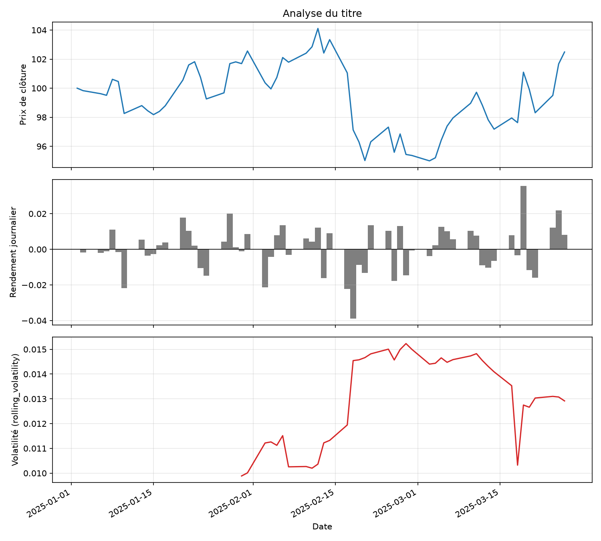

# Stock Price Analysis — Component A

Projet individuel du cours **MSA-DATI07-01 — Python Environments & Engineering Workflows** (Alessandro Cavinato).

## What & why

Un petit pipeline reproductible qui analyse une série de prix d'actions :

- calcule les **rendements journaliers** (`P_t / P_{t-1} - 1`) ;
- calcule la **volatilité glissante** (écart-type des rendements sur N jours) ;
- produit un graphique en trois panneaux (prix, rendements, volatilité) dans `outputs/plot.png`.

L'objectif n'est pas la finance mais l'ingénierie : environnement isolé (`venv`), dépendances pinnées, chemins robustes (`pathlib`), tests automatisés (`pytest`), script d'automatisation Bash et historique Git propre.

Les données de `data/sample_prices.csv` sont **fictives** (marche aléatoire, 60 jours ouvrés).



*Résultat de `python src/analysis.py` (fenêtre de 20 jours). Copie versionnée de `outputs/plot.png`, qui est ignoré par Git.*

## Setup

Prérequis : Python 3.10+ et Git.

```bash
git clone <url-du-repo>
cd <nom-du-repo>
python3 -m venv .venv
source .venv/bin/activate
pip install -r requirements.txt
```

## Usage

Pipeline complet (tests + analyse) :

```bash
./scripts/process_data.sh        # fenêtre de volatilité par défaut : 20 jours
./scripts/process_data.sh 10     # fenêtre personnalisée
```

Étapes séparées :

```bash
python src/analysis.py --window 20   # génère outputs/plot.png
pytest -q                            # lance les tests
```

Le script peut être lancé depuis n'importe quel répertoire : les chemins sont ancrés sur l'emplacement du fichier via `Path(__file__).resolve()`.

## Structure

```
.
├── data/
│   └── sample_prices.csv     # données d'entrée (Date, Close)
├── src/
│   └── analysis.py           # chargement, rendements, volatilité, graphique
├── scripts/
│   └── process_data.sh       # automatisation : tests puis analyse
├── tests/
│   └── test_analysis.py      # tests pytest (cas nominaux et cas limites)
├── outputs/                  # graphiques générés (ignorés par Git)
├── docs/
│   └── plot.png              # copie du graphique affichée dans ce README
├── requirements.txt          # dépendances pinnées (pip freeze)
├── .gitignore
└── README.md
```

## Tests

| Test | Type |
|---|---|
| Rendements de `[100, 110, 99]` = `[+10 %, -10 %]` | happy path |
| Données d'exemple chargées, triées, sans valeur manquante | happy path |
| Fenêtre plus grande que la série → volatilité entièrement `NaN` | edge case |
| Fenêtre < 2 → `ValueError` | edge case |
| Colonne `Close` absente → `ValueError` | edge case |
| Fichier inexistant → `FileNotFoundError` | edge case |
